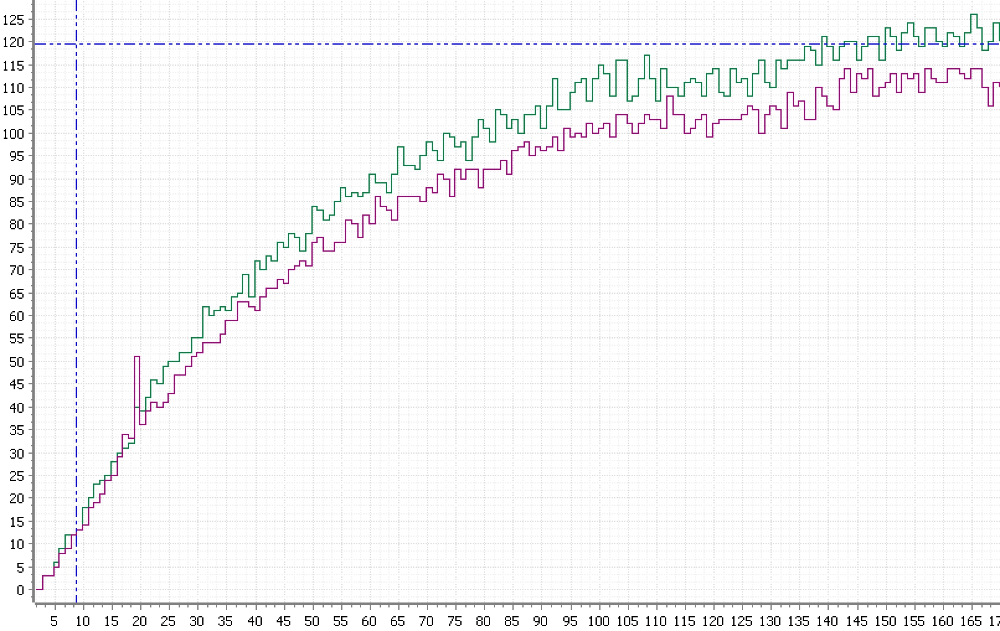
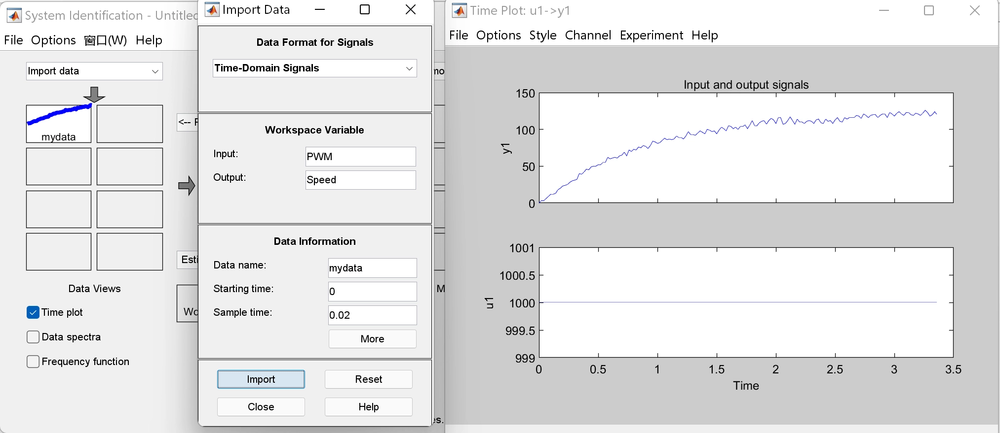
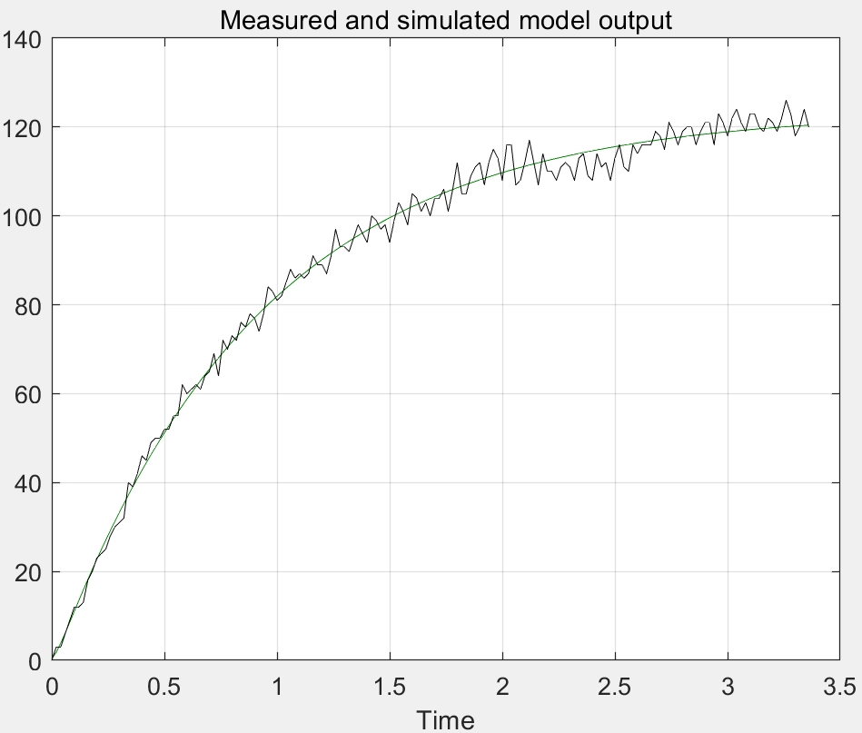
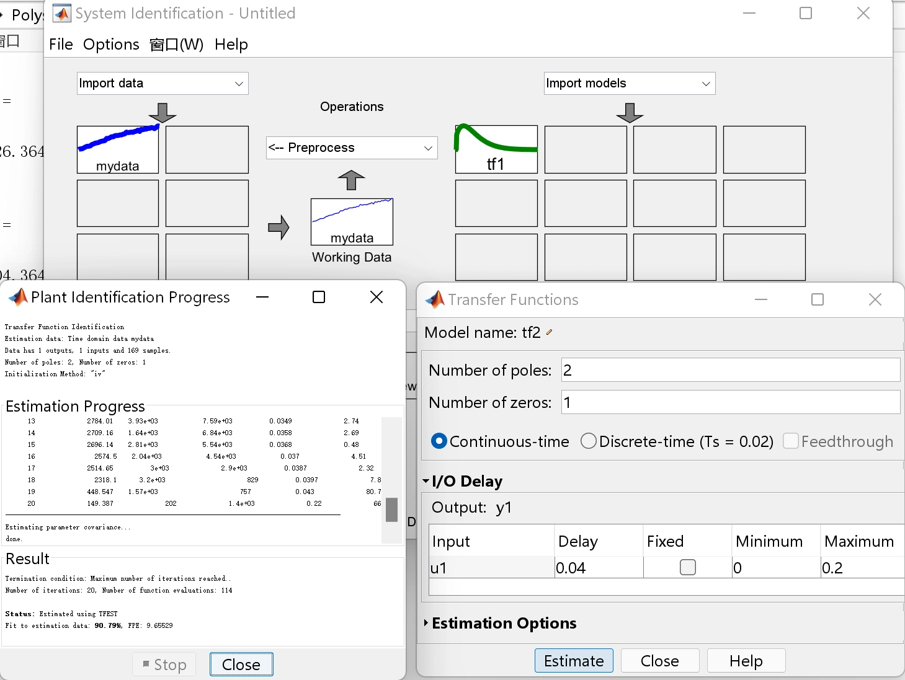
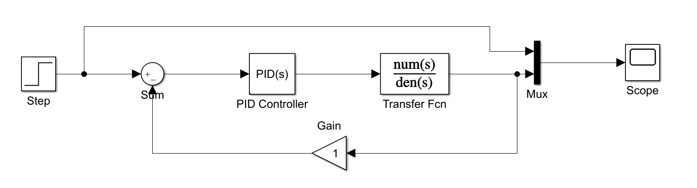
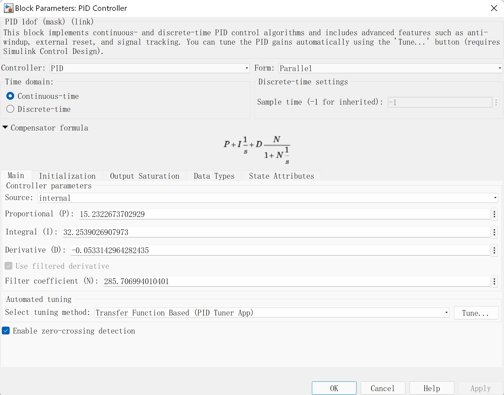
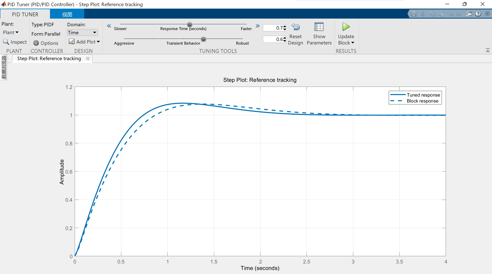
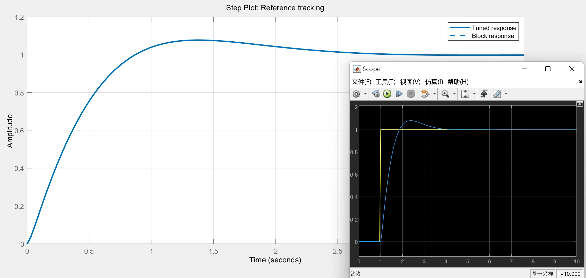

步骤：系统辨识传递函数 -> Simulink 仿真 -> PID Tuner 自动调参

# 系统辨识传递函数

## 采集数据

这里选择根据输入和输出数据辨识传递函数。

具体到智能车电机的话，就是在电机开环的情况下，给定电机恒定的占空比，将车放到赛道上，记录电机速度（编码器返回值）从 0 到接近稳定的曲线。

- 一定要开环测量数值，就是单纯给 PWM 即可。

- 给电机占空比的具体数值，最好使用电机以日常速度跑的时候的占空比。电机在正常运行的区间内，理论上这个关系应该是线性的，用任何占空比最终的效果都会差不多，但考虑到实际情况还是在日常使用的占空比范围区间内选取定值比较好，不过也不用过于纠结这里。
- 将车放到赛道上跑，是为了模拟实际在赛道上竞速时电机的负载情况。没有足够大小的赛道或是场地的话，找个摩擦相似的地面也可以。

- 采集数据，一定要以固定的频率发送给上位机。

  可以用串口转蓝牙的无线串口，配合匿名上位机完成原始数据的采集。

## 导入数据

### 导入数据到 MATLAB

我使用的环境是 MATLAB R2020b。

（Matlab 从 R2019a 开始就有了 STM32 的硬件支持包，Simulink 可以直接生成能下载到板子中运行的代码和程序。不过这部分我还没探索完咕咕咕

首先，在顶部选择导入数据，打开匿名上位机保存出来的 CSV 文件，选中速度的那列数据，并在上方将输出类型更改为数值矩阵，最后点击右侧将电机转速数据导入工作区。

还需要输入数据，也就是给电机的 PWM 定值。因为是定值所以只需要创建一个与输出数据元素个数相同的列向量即可。以上面图片的数据和情况为例，则是 `PWM = linspace(1000,1000,170)` `。注意需要在最后加上“ ' ”将行向量转为列向量。

### 导入数据到系统辨识工具箱

系统辨识这边我们自然选择的是根据数据建模的方案，而非直接使用机理建模。

之后在 MATLAB 的 App 中选择 `System Identification`

在左侧`import data`导入数据，导入的数据可以包括时域的也可以包括频域的，这里我们以选择`Time domain data`导入时间域数据为例。

`Workspace Variable`里的`input`为输入数据，填写 matlab 工作区内的输入数据变量名即`PWM`；Output 即需要填入输出转速变量名

`Data Information`里的`Starting time`为起始时间设为`0`即可；`Sample time`为采样时间单位是 s，根据自己单片机程序里设置的编码器的采样时间输入。注意编码器的采样频率应该和串口接收数据（也就是 matlab 工作区里的电机转速数据）的频率相同，不过如果丢包率很低也可以不用太在意。

勾选`time plot`会显示数据，可以检查数据是否正确。

## 系统辨识

接下来将左侧的 mydata 曲线拖动到`Working Data`中。要对数据进行操作时，都要把数据拖到 Working Data 中才能生效。

正常需要对电机转速的数据进行预处理。但因为我在单片机串口发送的数据就已经是一阶低通后的数据，所以可以不用再处理这部分。

在`Estimate`选择`Transfer Function Models`，然后设置合适的零点极点。电机模型一般零点为 1 极点为 2。

由于我们的转速的编码器采集的离散数据，所以我们需要将默认的连续性数据选项改为`Discrete-time (Ts = 0.0x)`（由于后面仿真的时候节点选的都是连续型，这里也就先按连续型做系统辨识，为了尽量保证准确性等我开学回实验室再次验证下之后再更新成离散型

`I/O Delay`是延时时间不用管默认 0 即可。也可以取消勾选`Time delay`中的`Fixed`，设置好 Minimum 和 Maximum 后会在区间内自动辨识时间延迟。

`Estimate`等待一小段时间的计算后即会计算出结果。拟合率一般`80%`为经验可用的界限。此时右侧的模型窗口出现了辨识的`tf1`

勾选`Model output`即可查看辨识结果。将辨识结果与原始实验数据叠加在一起，可以看到模型的辨识效果很好。

（只是为了演示就只采集了一小部分数据采样频率也不高

把辨识结果`tf1`拖拽到`To Workspace`即可导出到工作区，系统辨识完成。这时回到 MATLAB 主窗口即可查看工作区里 tf1 的信息。

# Simulink 仿真

按图连接节点，名称已经标出

也可以加入延迟模块模拟电机系统

（离散型其实应该使用的是 Discrete PID Controller 和 Discrete Transfer Fcn

双击`Transfer Fcn`填入刚刚辨识完的传递函数。具体数据双击工作区的 tf1 直接复制`tf1.Denominator`和`tf1.Numerator`即可

# PID Tuner 自动调参

双击`PID Tuner`。

上方`Controller`可以选择使用`PID`还是`PI/PD/P/I`。

右下方`Automated tuning`中，选择`Transfer Function Based (PID Tuner App)` ，之后点击`Tune`即可开始调参。

`DESIGN`中的`Domain`可以选择使用时间还是频率

在左上方`CONTROLLER`的`Options`可以更改设计偏好（Design Focus）。默认为`Balanced`，可选`Reference tracking/Input disturbance rejection`

调节上方两个按钮，`Response Time (seconds)`是上升时间（单位秒），另一个`Transient Behavior`可以理解成超调量。

实线为当前参数仿真效果，虚线为调整前的参数，方便对比。

`Show Parameters`为当前参数，以及各项指标。注意`PID Tuner`计算连续型时的积分项`I`需要乘上系统的采样时间（单位秒）才是常规位置式 PID 的参数。PID Tuner 调参完成。

另外 PID Tuner 整定参数的结果验证和 Simulate 后 Scope 显示的是一致的。

## 其他

其实 PID Tuner 出来的参数直接就已经是可以用的程度了。另外仿真也可以给出一个大概的参数范围，在这个结果上依据实际情况再修改参数，也会有更好的效果。我们最终在国赛时四个电机的速度环，就是在仿真出的参数的基础上调了一个小时左右就最终确定了的。

> 参考资料：
>
> PID Controller https://ww2.mathworks.cn/help/simulink/slref/pidcontroller.html
>
> System Identification 官方帮助文档 https://ww2.mathworks.cn/help/ident/index.html
>
> System Identification Toolbox https://ww2.mathworks.cn/products/sysid.html
>
> STM32 硬件支持包 https://ww2.mathworks.cn/products/hardware/stmicroelectronics.html
