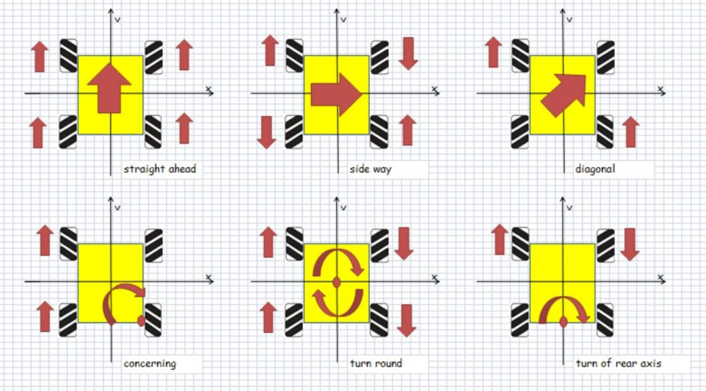
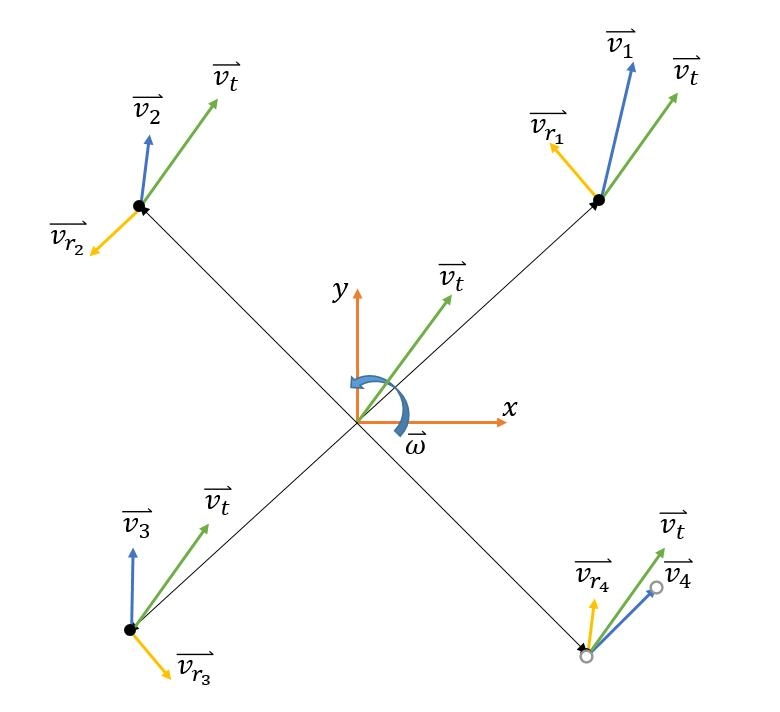

这篇麦轮的特色控制方案，不仅有我们实践出来效果不错并最终运用的，也有实践了效果一般但觉得思路或许还可以，也有实践效果很差可能是理论出问题但想法或许能有用的。这些情况也都会注明，这篇的作用更多是抛砖引玉！也希望大家能一起讨论！

元素处理分到了两篇文章中：[元素的处理方案：环岛，坡道，三叉，以及直道和弯道的速度控制方案](https://ittuann.github.io/2021/08/28/CarElement.html)以及本篇全向组麦轮的特色控制方案。

# 麦轮速度分解：

麦轮安装后通过速度分解，将底盘的运动期望解算至电机转速，分别控制四个轮子的转速，即可实现 3 个独立自由度上的运动运动。麦克纳姆轮驱动的车属与于 Holonomic，它的控制自由度等于整体自由度，因为它可以在平面坐标系内沿任意方向移动。小车可以由 2 个平面移动自由度和 1 个转动自由度分别控制。2 个平面自由度控制小车的位置，1 个转动自由度控制小车的姿态。所以小车所有的运行状况都可以用这三种情况耦合而成。

麦轮的运动模型推算过程略过，可以阅读参考资料，这里直接给出结论

可以解算出四个轮子的转速为

$$
\begin{cases}
v_{t_x} = \frac{1}{4}(-v_{\omega_1} + v_{\omega_2} - v_{\omega_3} + v_{\omega_4}) \\
v_{t_y} = \frac{1}{4}(v_{\omega_1} + v_{\omega_2} + v_{\omega_3} + v_{\omega_4}) \\
\omega = \frac{1}{4(a+b)}(v_{\omega_1} - v_{\omega_2} - v_{\omega_3} + v_{\omega_4})
\end{cases}
$$

同理，根据逆运动学模型中的三个方程逆向运算可解得，正运动学模型方程组为

$$
\begin{cases}
v_{\omega_1} = v_{t_y} - v_{t_x} + \omega(a+b) \\
v_{\omega_2} = v_{t_y} + v_{t_x} - \omega(a+b) \\
v_{\omega_3} = v_{t_y} - v_{t_x} - \omega(a+b) \\
v_{\omega_4} = v_{t_y} + v_{t_x} + \omega(a+b)
\end{cases}
$$

# 常规控制方案

常规的速度控制方案为二自由度，即只使用 Vy 和 w，不使用横向自由度 Vx，控制思路类似于三轮车模的差速控制。对于正常的直道和弯道最终我们就是只使用了这种二自由度的方案。这种方案好处在于十分稳定，不过车模的物理重心需要尽量接近四个麦轮的的中心这点更是尤为重要。

# 麦轮特色控制方案

所谓全向组的特色控制方案，即在常规三轮差速的二自由度控制上增加 x 轴向控制。具体我们尝试了全程三自由度循迹和元素内三自由度循迹。但因为全程三自由度循迹未能在一段时间内调参调整至传统二自由度的慢速档，再加上当时还有闭陀螺仪环的想法，最终仅在元素内使用三自由度。

- 坡道处理：常规二自由度若上坡位置不正，需要在坡道打角，容易造成在坡道上抖动并摔出坡道，并且高速过坡稳定性堪忧。麦轮车在识别到坡道后，可以切换控制模态，转为仅使用 Vy 和 Vx 这两个自由度，即在上坡时通过横向平移修正姿态。这样可以做到稳定过坡，并且即使开启坡道加速也能有不错的稳定性。

  注意在上坡后最好开始横向计步（即编码器 Vx 累加），开启限幅为坡道三分之一左右的宽度，避免过矫摔下坡道，限幅防摔这一点也是传统二自由度很难做到的。

- 环岛处理：四轮在处理环岛时会遇到内切或是外切环岛，此时可能需要赋予不同的摄像头中值或是切换摄像头补线等特殊处理。而麦轮车仅需要加上 X 轴向反方向的一点速度补偿即可实现环岛内稳定循迹。

  对于环岛内 Vx 方向速度的确定，因为我们并未整定出三自由度高速循迹的参数，所以仅使用凑试打表的方法赋予定值。但赋予定值的效果也能算得上可以，十分钟左右就凑试出了当前环内速度对应的定值，并在速度控制算法和摄像头补线均未变时该定值很稳定。在我们尝试三自由度低速循迹的方案，只需要稍加修改参数即可过环，不过高速情况与低速可能差异很大，我们的思路仅为抛砖引玉。

  对于左右环岛不对称问题，也可以赋予不同横向速度来修正偏移量。

- 三叉路口：三叉内外切问题，以及左右不对称问题，我们的处理方案与环岛相同，在二自由度的基础上增加 Vy 方向的补偿即可。

- 小 s 弯：对于识别到小 s 弯后，可以切换控制模态为 Vy 和 Vx 二自由度循迹，即平移过小 s 弯。不过常规控制小 s 弯内 w 打脚本身也不会很大。我们尝试当时速度并不快，二者区别并不大，反而因为小 s 弯内加速后横向速度稍微过大就会打滑漂移冲出路肩，使得参数整定变得困难，再加上摄像头也不能稳定判断出小 s 元素，最后线上赛大小 s 弯不占分数也没有设计进赛道，最终并没有一套稳定可行的方案。不过平移过小 s 很具观赏性，当时可加速量也高于传统控制，这种针对小 s 的控制也算是抛砖引玉吧。

- 平移出库：平移出库胜在稳定性，编码器 vx 方向计步很稳定。对于高速出库平移可以单独拉出一个 PID 参数，不过即使使用正常三叉横向循迹的 PID 参数效果依旧可以。另外可以在平移之外再给 y 轴速度，实现斜对角出库。横向出库速度不输舵机打角出库，出库总共用时不长也不会过 1s，反而受出库位置限制更小也不会撞路肩更加稳定。

  对于入库我们还是采用传统补线入库，三斤多的全向车定点刹车再平移对控制精度要求太高了，对于入库来说没有必要调整那么精细，传统二自由度足够了。

- 三自由度循迹：将摄像头误差传递给 w 轴和 Vx 轴，使用两种不同模态 PID 控制，最终再输出给电机环。
