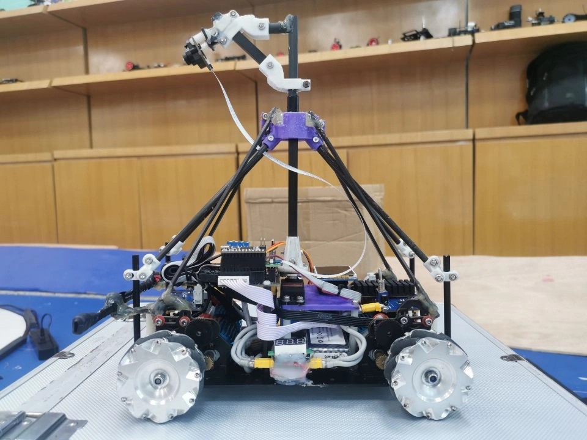
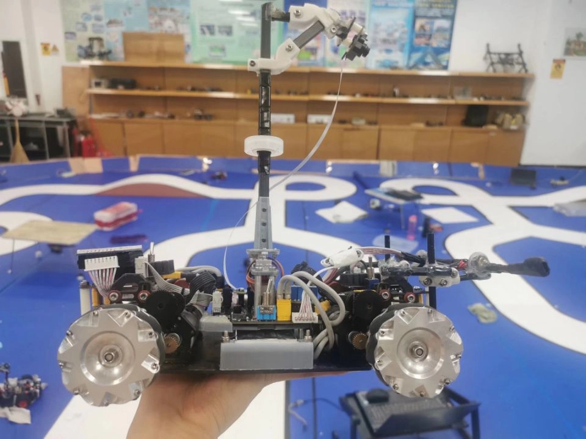
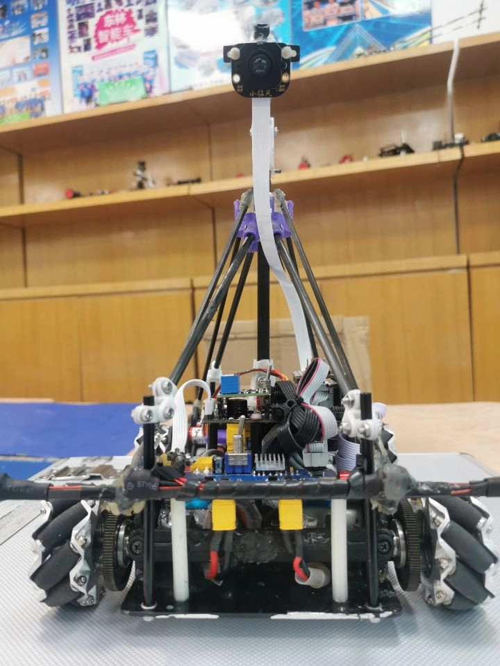
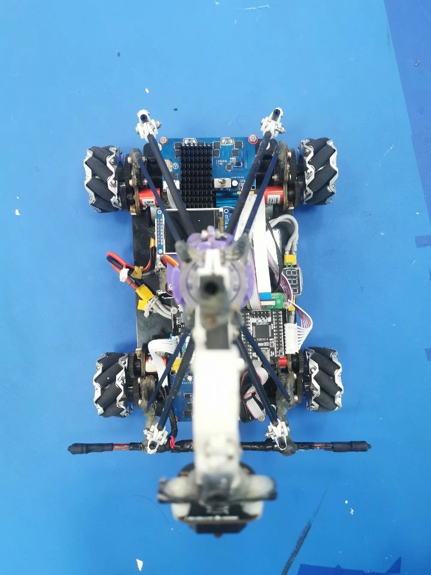
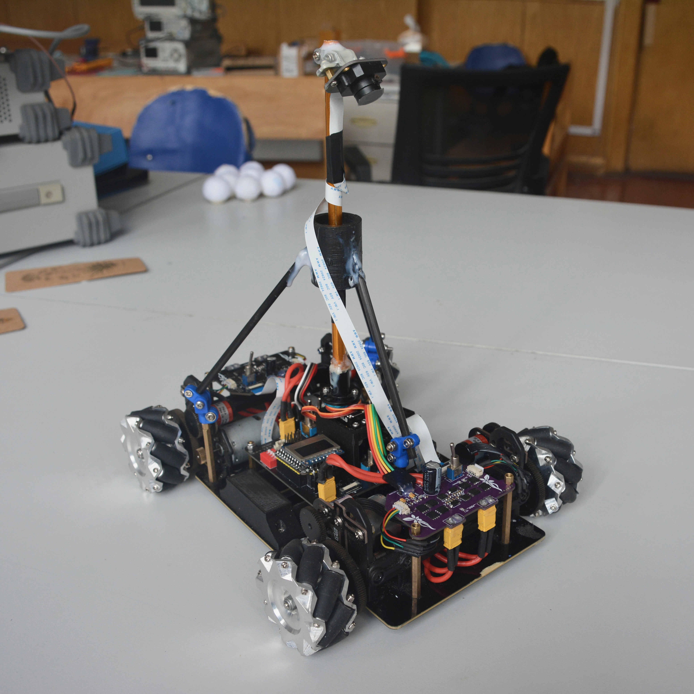

**开源代码地址：** <https://github.com/ittuann/Enterprise_E>

---

- [PID 控制：常规 PID 以及改进式 PID](https://blog.ittuann.com/posts/car-pid/)
- [PID 调参：MATLAB 系统辨识和仿真 PID 调参，以及根据打表公式计算参数](https://blog.ittuann.com/posts/car-simulate/)
- [四种常见滤波和 MATLAB 仿真：一阶 RC 低通滤波，二阶 IIR 滤波，五阶 FIR 滤波，卡尔曼滤波](https://blog.ittuann.com/posts/car-filters/)
- [元素的处理方案：环岛，坡道，三叉，以及直道和弯道的速度控制方案](https://blog.ittuann.com/posts/car-element/)
- [探索全向组麦轮的特色控制方案](https://blog.ittuann.com/posts/car-spcontrol/)
- [摄像头循迹控制](https://blog.ittuann.com/posts/car-tracking/)
- [上下位机设置：匿名上位机 V7，TFMiniPlus 激光雷达测距](https://blog.ittuann.com/posts/car-upper/)
- [机械结构选择与踩雷](https://blog.ittuann.com/posts/car-machine/)
- [一些想要说但不好归类的杂项](https://blog.ittuann.com/posts/car-others/)

---

​这次只开源了除摄像头以外的全部工程。摄像头的程序因为用到了一些往届学长留下来的东西，所以也就不开源啦。

​这份程序是我从大一上作为机械大类的学生完成招新任务进入实验室开始，从学 C 语言和单片机，一直写到暑假比赛结束，代码也是逐渐跟着学习进度叠起来的。即使是比完赛后过了不到半个学期再看自己的程序，还是能发现有一些蛮不满意的地方，那就更不用说做车的前辈和学长们了。赛后也想把程序整理下弄得更工整和美观一些，不过这辆车已经被下一届的预备役选手拆掉准备明年的比赛了，修改后的程序也不能再上车验证一下，于是还是干脆开源这份赛后稍加改动的程序吧！还有遗憾的地方就在明年的 RoboMaster 完善好了！

​所以这份开源的程序作用更多是抛砖引玉！一些想法，还有控制的算法和思路也尽量都用文字在博客里面说了一下~

​这次十六届的比赛有些遗憾，在正式比赛的第六圈陀螺仪掉线了，最终只有 245 分没能跑出日常 315 的成绩。陀螺仪大概是赛前一周出现过这个问题，不过当天晚些时候又自己好了这问题也就没管。正式比赛前完整流程跑了十几次测试稳定性也都正常，嗯然后赛场上就出现问题了，赛后重新烧程序跑了也没事...

​这是我们一年来调车的日常记录~ <https://www.bilibili.com/video/BV1Aq4y1T7ZE>

​在这段调车的日子里，从最初听说智能车的光鲜外表，再到后来慢慢了解到他的真实，他的残酷，但是喜欢的心情却从未减少。虽然天天在说调车苦，但回过头来看这段日子总是闪着光的，生活充实，好友成群。我心底还是喜欢智能车的，就算虐我千百遍，我依旧喜欢。如果再给我一次选择的机会，我还是会选择做智能车。也多亏了智能车，让我的黑白的大学月考生活多了些斑斓的色彩。

​最后，我想再次感谢我的两位队友！两位学长真的是给了我足够的信赖，愿意让我放手去尝试和探索，也愿意陪我一起试错和讨论，在我调车到了瓶颈在原地打转的时候也给了我不少安慰。不仅仅是比赛，在生活上也给了我我不小的支持。还有实验室同在做十六届不同组别的其他学长们，大家对从零开始的我真的很包容，这不是套话而是真心的。能和这样一群人生活在一起，我真的很快乐很幸福~ 感谢我们苦中作乐度过了最辛苦的一段时光~

​不知道是不是很合适地引用罗翔老师 21 年的百大获奖感言作为结尾吧。“运气呢并非成就，命运之手把我托举到所不配有的高度，让人飘然，让人眩晕，最终，让人诚惶诚恐”

---

再放一些我们车车的照片！

