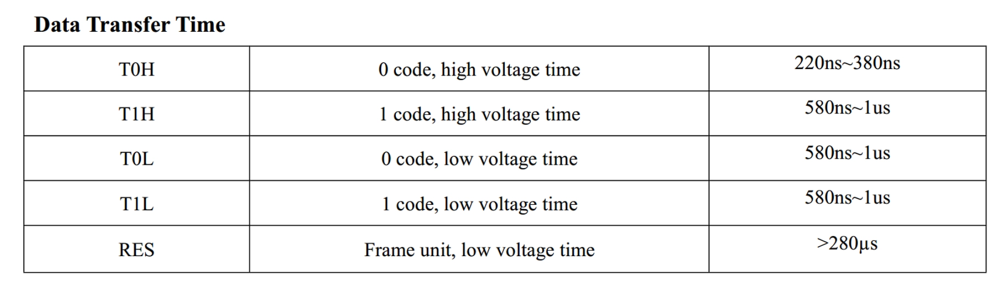
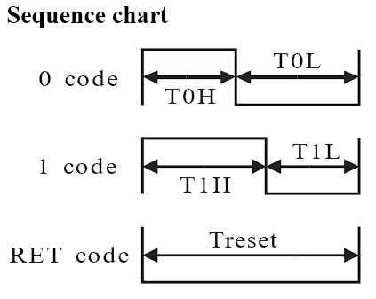
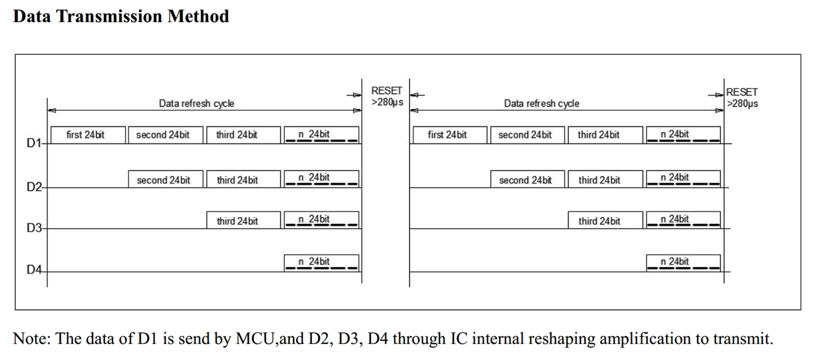
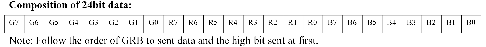

# SPI+DMA 驱动 WS2812

比赛的能量机关用的是内置 IC 的 LED 灯珠，官方的灯条是 SK6812 灯珠，每米 144 个灯珠，但是真的贵（

于是用了华彩威的 WS2812 灯珠。其实更好的选择是用 WS2813，使用 6PIN 角封装支持了断点续传，即一个灯珠坏了后面的灯珠还能继续工作，除非连续两个灯珠损坏。或是用 WS2815 灯珠，12V 供电可以降低整个像素点的工作电流以及压降。另外 WS2812、WS2813、WS2815 以及 SK6812 的通信协议是相似的。这种内置 IC 的 LED 灯珠还有很多像是 SK6813、SK6822、SK6815、PLK6812、PLK6815B 等等。

很恶心的一点是，WS2812 的逻辑 0 和 1 表达示方式这部分，网上好多图都是不对的，一定要以数据手册为准... 如果逻辑 0 和逻辑 1 的发送时序不对，那么整个灯条的颜色都是乱的甚至根本不会亮。









## 先放一段 QA 吧

Q1: 像这种一根信号线输出控制的逻辑电平一般都要求 5V 及以上，需要 3.3V 升 5V 吗

A1: STM32 虽然只能输出 3.3V，但是控 WS2811 是可以的。另外 3.3V 升到 5V，三极管或是 MOS 管的信号上升时间相对而言太长了，跟不上控制信号的变化，导致几乎输不出信号

Q2: 直接用 IO 口翻转可以控制吗

A2: 不太行。用封装库函数翻转 IO 的执行速度，很难满足几百 ns 到 1us 级别的时间要求，虽然可以直接操作寄存器，但即使是对着示波器一点点测试`NOP`空指令的个数，也只是一种时序近似。随着灯条长度的加长和信号发送时间的推移，总会出现逻辑 0 和 1 的误识别的情况。并且中断也会打断时序模拟。

Q3: FreeRTOS 会影响控制的时序吗

A3: 配上稍高一些的任务优先级，使用 SPI+DMA 不会影响

Q4: 一条总线能控多少灯

A4: 测试一条 SPI+DMA 控了 1920 个灯珠也依旧能正常控制，更多的灯珠没设备了也就没测。只要时序对了理论上是能控制无限个的

## 控制方式

单总线，通过总线上高低电平时间长短的不同来区分逻辑 0 和 1。

WS2811 的通信速度为 800Kbit/s，如果将 SPI 的频率设置为 6.4MHz，正好是灯条 IC 芯片的 8 倍，那么每一个字节 (8 位) 正好对应一个逻辑位，也就是`11110000`代表逻辑 1，`11000000`代表逻辑 0

数据传输时间 TH+TL=1.25us±600ns，协议也有 150ns 的兼容性。比如 SPI 设置为 5.25MBits/s(Mbps)（84MHz 时钟线 16 分频），传输 1Bit 的时间为`1*10^9ns / 5.25*10^6 = 190ns`，一个字节需要 1.52us 也在传输时间范围内，所以可以通过 SPI 的 MOSI 输出信号线发送一个字节 Byte(8bits) 的数据模拟 WS2812 的一个位。所以发送一个 uint8 字节 0xF0(11110000)，高电平时间为 4x190=760ns 在 580ns-1us 范围之间，代表逻辑 1；0xC0(11000000)，高电平时间为 380ns 在 220ns-380ns 范围，代表逻辑 0

## CubeMX 配置

- 开启 SPI1，因为只用到了`MOSI`输出信号线，所以模式选择`Transmit Only Master` 仅发送主模式 就可以。

  - Data Size (通讯的数据帧大小是) 设置为 `8 Bits`。理由是因为上面的控制方式
  - CPHA (时钟相位) 设置为 `2 Edge`。MOSI(和 MISO) 数据线上的信号将会在 SCK 时钟线的偶数边沿采样。因为发送数据的末尾都是低电平，这样 WS2812 不会误判

  - CPOL (时钟极性) 不用修改默认为 `Low`，即总线空闲时 SCK 的时钟状态为低电平

  - FirstBit 不用修改默认为`MSB`先行，即高位数据在前

  - CRC Calculation 不用修改默认为`Disable` ，即不启用 CRC 计算和发送

- 开启 DMA。
  - Mode 设置为`Normal`一次传输，不需要循环传输模式，由程序手动触发 DMA 发送即可。
  - Direction (传输方向) 设置为`Memory to Peirpheral`存储器到外设
  - Data Width (数据宽度) 设置为`Byte`字节 (8 位)
  - Priority (优先级) 设置为`Very High`。注意 DMA 优先级只有在多个 DMA 数据流同时使用时才有意义

## 程序

```c
#define LED_NUM		31	// LED 灯珠个数
#define RESET_HEAD	280	// Rest 复位码所需长度

// 模拟 bit 码：0xC0 为逻辑 0, 0xF8 为逻辑 1
const uint8_t code[2] = {0xC0, 0xF8};

typedef struct {
  uint8_t R;
  uint8_t G;
  uint8_t B;
} RGBTypeDef_t;	//颜色结构体

RGBTypeDef_t RGB_Data[LED_NUM] = {0};					// 设置灯珠颜色
uint8_t RGB_BUFFER[LED_NUM * 24 + RESET_HEAD] = {0};	// 发送数据缓存

// 常见颜色定义
const RGBTypeDef_t WS2812_RED = {255, 0, 0};
const RGBTypeDef_t WS2812_GREEN = {0, 255, 0};
const RGBTypeDef_t WS2812_BLUE = {0, 0, 128};

/**
  * @brief			设置指定灯珠要显示的颜色
  * @param[in]		ID 颜色
  */
void Set_LEDColor(uint16_t LedId, RGBColor_TypeDef Color)
{
    RGB_Data[LedId].G = Color.G;
    RGB_Data[LedId].R = Color.R;
    RGB_Data[LedId].B = Color.B;
}

/**
  * @brief			刷新全部 WS2812 灯珠颜色
  * @param[in]
  */
void RGB_Reflash(void)
{
	uint8_t dat_g = 0, dat_r = 0,dat_b = 0;
	// 将数组颜色转化为 24 个要发送的字节数据
    for (uint16_t i = 0; i < LED_NUM; i ++ ) {
		// 存入颜色缓存
        dat_g = RGB_Data[i].G;
        dat_r = RGB_Data[i].R;
        dat_b = RGB_Data[i].B;
		// 转换为 0/1 码的通信协议
        for (uint8_t j = 0; j < 8; j ++ ) {
            RGB_BUFFER[RESET_HEAD + i * 24 + 7 - j] = code[dat_g & 0x01];
            RGB_BUFFER[RESET_HEAD + i * 24 + 15 - j] = code[dat_r & 0x01];
            RGB_BUFFER[RESET_HEAD + i * 24 + 23 - j] = code[dat_b & 0x01];
            dat_g >>= 1;
            dat_r >>= 1;
            dat_b >>= 1;
        }
	}
	// 等待上次 DMA 传输完成
	while (HAL_DMA_GetState(&hdma_spi1_tx) != HAL_DMA_STATE_READY);
	// SPI+DMA 发送所有数据
	HAL_SPI_Transmit_DMA(&hspi1, RGB_BUFFER, LED_NUM * 24 + RESET_HEAD);
}

/**
  * @brief			配置 WS2812 全部显示为蓝色
  */
void WS2812_Show_BLUE(void)
{
	for (uint16_t i = 0; i < LED_NUM; i ++ ) {
		Set_LEDColor(i, WS2812_BLUE);
	}
	RGB_Reflash();
}
```

如果灯珠数量很多，可以选择 SPI+DMA 一次只发送 1 个灯珠所需的 24 字节数据，通过多次发送完成控制。

```c
static void SPI_Send_WS2812(SPI_HandleTypeDef *hspi, uint8_t *SPI_RGB_BUFFER)
{
    while (HAL_DMA_GetState(&hdma_spi1_tx) != HAL_DMA_STATE_READY);
    HAL_SPI_Transmit_DMA(hspi, SPI_RGB_BUFFER, 24);
}

void RGB_Reflash(void)
{
    uint8_t RGB_BUFFER[24] = {0};
    // 发送 Rest 复位码
    for (uint16_t i = 0; i < RESET_HEAD; i ++ ) {
        SPI_Send_WS2812(&hspi1, SPI_RGB_BUFFER);
    }
    // 发送颜色数据
    for (uint16_t i = 0; i < LED_NUM; i ++ ) {
		......
        for (uint8_t j = 0; j < 8; j ++ ) {
            ......
        }
        SPI_Send_WS2812(&hspi1, SPI_RGB_BUFFER);
	}
}
```
